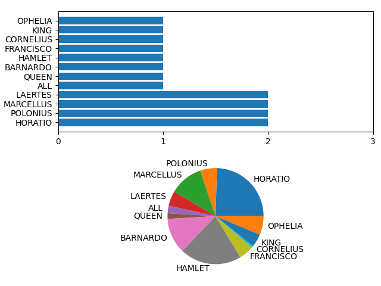

## Programozás alapjai 2.

### 1. Zárthelyi dolgozat

A feladat **Színdarabok** és azok **Jeleneteinek** adatait kezelő osztályok készítése a [play.py](play.py) fájlban.

Egy színdarab több jelenetből áll, melyek szövegkönyvei szöveges, `.txt` kiterjesztésű fájlokként vannak tárolva a színdarab könyvtárában. (Más kiterjesztésű fájlok is lehetnek ott.)

Egy jelenet szövegkönyve megadja a **Szereplők** szövegeit.
Minden szereplő minden megszólalása egy olyan sorral kezdődik, amiben csak a szereplő neve van, csupa nagybetűvel írva.
Majd ezt a sort követi a megszólalás szövege (ez több sor is lehet).
Például:
```
BARNARDO
Have you had quiet guard?

FRANCISCO
Not a mouse stirring.

BARNARDO
Well, good night.
If you do meet Horatio and Marcellus,
The rivals of my watch, bid them make haste.
```

A `Play` osztály tárolja egy színdarab adatait:
- szerző
- cím
- szereplők
- jelenetek

A `Play` konstruktora megkapja a szerzőt, címet, és a jelenetek szövegkönyveit tartalmazó könyvtár elérési útját. A jelenetek `Scene` objektumokként legyenek tárolva.

A `Scene` konstruktorban kapja meg a szövegkönyv elérési útját, és olvassa be belőle a jelenetet.
Ha a megadott fájl nem található, írjon ki hibaüzenetet, de folytatódjon a program.
A jelenetekről olyan formában kell tárolni az adatokat, ami segíti az alábbi lekérdező metódusok kiértékelését (a kiértékeléskor már ne kelljen fájlból olvasni).

A `Play`-nek a `scene_count(character)` metódusával lehessen lekérdezni, hogy egy szereplő hány jelenetben szerepel.

A `Scene`-nek a `speech_count(character)` metódusával pedig azt, hogy a jelenetben hányszor szólal meg egy szereplő.

A fenti metódusok felhasználásával készüljön egy további `show_charts()` metódus a `Play` osztályhoz, amely két egymás feletti diagramon jeleníti meg a statisztikákat:
- Felül egy vízszintes oszlopdiagram ábrázolja, hogy melyik szereplő hány jelenetben szerepel.
- Alul egy kördiagram mutassa be, hogy a szereplők megszólalásainak számai (a teljes színdarabban) hogyan aránylanak egymáshoz.

Példa: 
